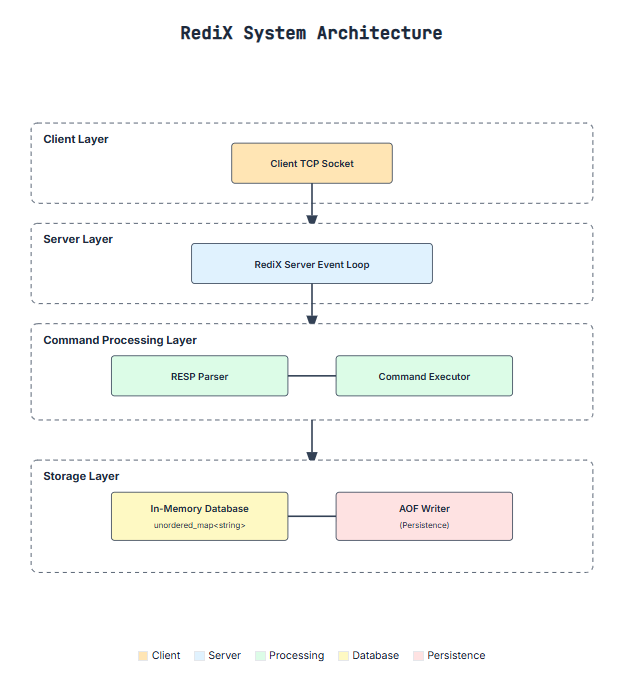

# RediX Architecture (High-Level Overview)

RediX is a lightweight, Redis-inspired in-memory key–value database written in C++.
Its primary goals are simplicity, speed, and learnability, while maintaining a clean modular design.

## Core Goals

- **Minimal Redis-like functionality:** `GET`, `SET`, `DEL`, `INCR`, `PING`, `EXISTS`
- **Single-threaded event loop:** Efficient and lock-free
- **In-memory dictionary:** Primary data structure for fast O(1) access
- **Append-Only File (AOF) persistence:** Ensures crash recovery
- **RESP (Redis Serialization Protocol) compatible:** Enables interoperability with Redis clients
- **Small, readable C++ codebase:** Easy to maintain and extend

